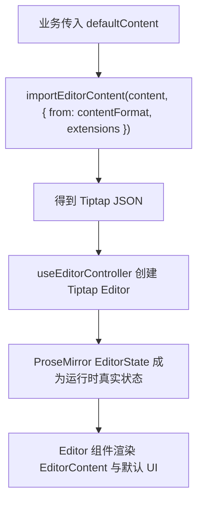
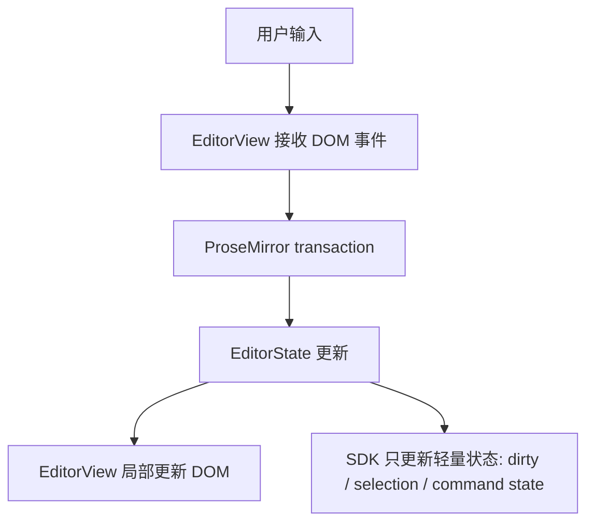
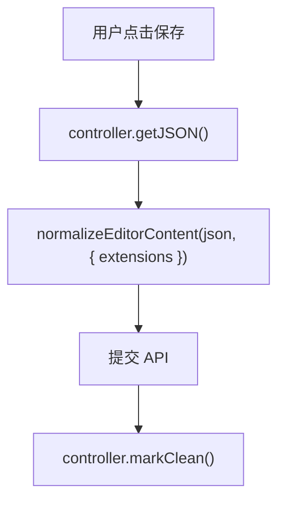
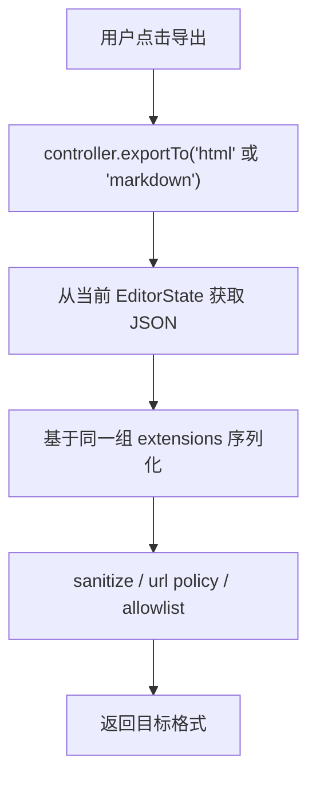
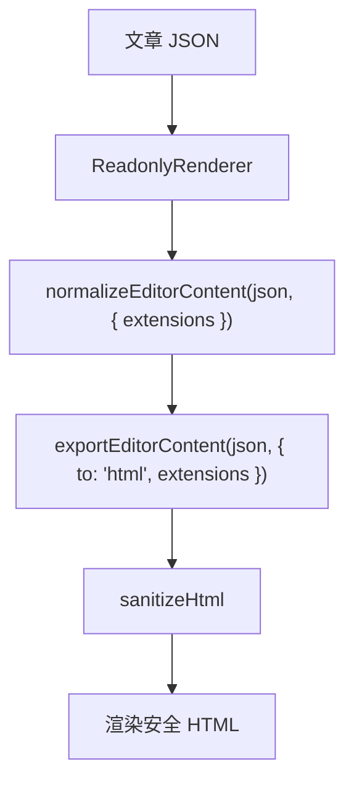

# Editor SDK Rewrite Plan

> **For agentic workers:** REQUIRED SUB-SKILL: Use `subagent-driven-development` or `executing-plans` to implement this plan task-by-task. Steps use checkbox (`- [ ]`) syntax for tracking.

**Goal:** 重写 `@namelesserlx/editor` 的运行时与内容处理 API，让编辑器像官方 Tiptap 一样以 `EditorState` 为运行时状态，同时让业务侧只传 `extensions`，不再手写 Tiptap `Node`、`mergeAttributes`、readonly schema、normalize options 或兼容性处理。

**Architecture:** `extensions` 是唯一 schema 来源。编辑输入链路只走 ProseMirror transaction，不在每次输入时全量 `getJSON()`、HTML/Markdown 转换或 React 受控状态同步；导入、导出、只读渲染、持久化校验都在低频操作中基于同一组 `extensions` 派生能力。

**Tech Stack:** React 19, Tiptap 3, ProseMirror, DOMPurify, Vitest, jsdom, tsup.

---

## 1. 背景

这次重写的目标不是兼容旧 API，而是把 `@namelesserlx/editor` 做成一个真正通用、低心智负担、性能接近官方 Tiptap 的 SDK。

当前最大问题不是某个单点 bug，而是使用边界错了：业务侧为了使用只读渲染、持久化校验和自定义节点，开始直接导入 `@tiptap/core`，手写 `Node.create`、`mergeAttributes`、自定义 readonly 节点和一堆 sanitizer。这说明 SDK 没有把“运行时 schema、format schema、readonly schema、normalize schema”收敛到一个清晰入口。

最终版应该做到：

- 业务侧只关心 `extensions` 和少量业务配置。
- SDK 内部从同一组 `extensions` 派生编辑、导入、导出、只读渲染、normalize 能力。
- 编辑输入时不做全量文档序列化，不把整篇文章放进 React state 作为高频受控值。
- 自定义扩展的节点、属性、marks、schema 信息不丢失。
- SDK 不绑定业务扩展，也不认识 `codeBlockPro`、`uploadImage`、`uploadVideo`、`uploadFileCard` 这些业务节点。

## 2. 当前问题

### 2.1 应用层越过了 SDK 边界

问题文件：

- `/Users/wumingshi/devCode/Blog/apps/blog/app/articles/[id]/article-content-policy.ts`
- `/Users/wumingshi/devCode/Blog/apps/blog/app/articles/[id]/content-format.ts`
- `/Users/wumingshi/devCode/Blog/apps/blog/app/articles/[id]/_components/ArticleContentRenderer.tsx`
- `/Users/wumingshi/devCode/Blog/apps/admin/client/src/pages/Blog/article/editArticle/articleEditorPolicy.ts`
- `/Users/wumingshi/devCode/Blog/apps/admin/client/src/pages/Blog/article/editArticle/articleEditorContent.ts`

现在 `apps/blog` 为了让只读渲染识别业务节点，直接依赖：

```ts
import { mergeAttributes, Node, type Extensions } from '@tiptap/core';
```

这不应该出现在使用层。`Node.create` 是扩展作者要写的东西，不是使用 `@namelesserlx/editor` 的业务方每次都要写的适配代码。

### 2.2 schema 来源不统一

当前至少有几套 schema/规则：

- 编辑器运行时 extensions。
- format 导入导出 extensions。
- readonly renderer extensions。
- normalize options。
- 应用侧 sanitizer。

这些集合只要有一个漏掉节点或 mark，就会出现：

- 编辑器能生成的 JSON，导出 HTML/Markdown 时丢节点。
- 后台保存后，业务自定义节点被 normalize 清掉。
- 前台只读渲染遇到未知节点报错或降级。
- 颜色、highlight、textAlign 等 marks 在某些链路丢失。

### 2.3 `inputFormat` / `outputFormat` 容易诱导错误性能模型

旧形态类似：

```tsx
<Editor value={content} inputFormat="json" outputFormat="json" onChange={setContent} />
```

这个 API 容易让使用者以为编辑器是普通受控表单组件。对于长文富文本，这是错误模型。

如果每次输入都执行：

- `editor.getJSON()`
- normalize
- HTML/Markdown serialize
- `setState(fullDocument)`
- 外部 value 回灌比较

输入延迟会随文档长度增长，性能明显弱于官方 Tiptap 的 transaction 模型。

### 2.4 只读渲染被复杂化

业务侧现在为了前台文章展示，手写了 `CodeBlockProReadonly`、`UploadImageReadonly`、`UploadVideoReadonly`、`UploadFileCardReadonly`。

这本质是在补 SDK 的洞：SDK 没有让 `ReadonlyRenderer` 直接复用业务传入的 Tiptap extensions。

最终应该是：

```tsx
<ReadonlyRenderer
  content={article.content}
  contentFormat="json"
  extensions={ARTICLE_EDITOR_EXTENSIONS}
/>
```

而不是业务侧再维护一套 readonly extension。

## 3. 设计原则

### 3.1 `extensions` 是唯一 schema 来源

SDK 不再要求业务调用：

```ts
createNormalizeOptions(createFormatExtensions(options));
```

也不要求业务维护：

```ts
ARTICLE_READONLY_EXTENSIONS;
ARTICLE_CONTENT_NORMALIZE_OPTIONS;
ARTICLE_ATTRIBUTE_SANITIZERS;
```

最终统一为：

```ts
normalizeEditorContent(content, {
  extensions: ARTICLE_EDITOR_EXTENSIONS,
});
```

或者在组件里直接：

```tsx
<Editor extensions={ARTICLE_EDITOR_EXTENSIONS} />
<ReadonlyRenderer extensions={ARTICLE_EDITOR_EXTENSIONS} />
```

### 3.2 SDK 不认识业务节点

SDK 不能出现这些业务名字：

- `codeBlockPro`
- `uploadImage`
- `uploadVideo`
- `uploadFileCard`
- `dragHandle`

这些能力由业务传入的 Tiptap extensions 提供。

如果某个第三方扩展不能在只读/SSR/静态渲染下工作，应该由扩展包提供自己的 static-safe export 或修复扩展内部实现，而不是让业务在 `apps/blog` 里手写 `Node.create` 兜底。

### 3.3 运行时状态属于 Tiptap

编辑中，活跃状态是：

```text
DOM input -> ProseMirror transaction -> EditorState -> EditorView
```

React state 不持有整篇文章的高频副本。

SDK 可以暴露轻量状态，例如：

- `isReady`
- `isDirty`
- `isEmpty`
- `canUndo`
- `canRedo`
- `activeMarks`
- `activeNodes`

但不能默认在每个 transaction 里全量导出 JSON。

### 3.4 导入导出是低频动作

全量 JSON/HTML/Markdown 转换只能发生在这些场景：

- 初始化。
- 外部主动替换内容。
- 保存草稿。
- 发布。
- 导出 HTML/Markdown。
- 只读渲染前的服务端或客户端渲染。

不应该发生在每次输入时。

### 3.5 安全边界由 SDK 默认兜住

SDK 负责提供默认安全策略：

- HTML sanitize。
- URL policy。
- raw HTML 默认禁止。
- iframe/第三方嵌入默认禁用。
- 允许业务传入 allowlist，但不内置业务站点。

业务侧不应该为了普通使用写大量 `pickString`、`pickBoolean`、`sanitizeAssetUrl` 这类兼容代码。

## 4. 最终用户 API

### 4.1 编辑器推荐用法

```tsx
import { Editor, useEditorController } from '@namelesserlx/editor/react';
import { CodeBlockPro } from '@tiptap-codeless/extension-code-block-pro';
import { DragHandle } from '@tiptap-codeless/extension-drag-handle';
import { FileUpload } from '@tiptap-codeless/extension-file-upload';

const ARTICLE_EDITOR_EXTENSIONS = [
  CodeBlockPro.configure({
    defaultLanguage: 'javascript',
    theme: 'auto',
  }),
  DragHandle.configure({
    insertMenu: {
      trigger: '/',
    },
  }),
  FileUpload.configure({
    storageMode: 'custom',
    upload: uploadArticleAssets,
    imgBubbleMenuConfig: {
      enabled: false,
    },
  }),
];

export function EditArticle({ article }: { article: Article }) {
  const editor = useEditorController({
    defaultContent: article.content,
    contentFormat: 'json',
    extensions: ARTICLE_EDITOR_EXTENSIONS,
    locale: 'zh-CN',
  });

  async function saveDraft() {
    const content = editor.getJSON();
    await saveArticle({ content });
    editor.markClean();
  }

  return (
    <>
      <Editor controller={editor} />
      <button onClick={saveDraft}>保存草稿</button>
    </>
  );
}
```

关键点：

- 没有 `value`。
- 没有高频 `onChange(fullDocument)`。
- 没有 `outputFormat`。
- 保存时才 `editor.getJSON()`。
- 业务只传真实 Tiptap extensions。

### 4.2 只读渲染推荐用法

```tsx
import { ReadonlyRenderer } from '@namelesserlx/editor/readonly';

export function ArticleContent({ article }: { article: Article }) {
  return (
    <ReadonlyRenderer
      content={article.content}
      contentFormat="json"
      extensions={ARTICLE_EDITOR_EXTENSIONS}
      locale="zh-CN"
    />
  );
}
```

关键点：

- 不再有 `ARTICLE_READONLY_EXTENSIONS`。
- 不再有 `ARTICLE_CONTENT_NORMALIZE_OPTIONS`。
- 不再有应用层 `Node.create`。
- 不再让 `apps/blog` 依赖 `@tiptap/core`。

### 4.3 纯函数用法

低频任务使用纯函数：

```ts
import {
  exportEditorContent,
  importEditorContent,
  normalizeEditorContent,
} from '@namelesserlx/editor/core';

const content = importEditorContent(markdown, {
  from: 'markdown',
  extensions: ARTICLE_EDITOR_EXTENSIONS,
});

const safeContent = normalizeEditorContent(content, {
  extensions: ARTICLE_EDITOR_EXTENSIONS,
});

const html = exportEditorContent(safeContent, {
  to: 'html',
  extensions: ARTICLE_EDITOR_EXTENSIONS,
});
```

命名语义：

- `importEditorContent`: 外部格式进入编辑器内容。
- `exportEditorContent`: 编辑器内容导出为外部格式。
- `normalizeEditorContent`: 对编辑器 JSON 做 schema-aware 校验和清理。

不再使用容易混淆的：

- `inputFormat`
- `outputFormat`

纯函数里使用：

- `from`
- `to`

组件里使用：

- `contentFormat`

这样语义更清楚。

## 5. `EditorController` 契约

```ts
export interface EditorController {
  editor: TiptapEditor | null;
  isReady: boolean;
  isDirty: boolean;
  isEmpty: boolean;

  focus(): void;
  blur(): void;
  clear(): void;
  markClean(): void;

  setContent(
    value: EditorContentInput,
    options?: {
      format?: EditorContentFormat;
      emitUpdate?: boolean;
    },
  ): void;

  getJSON(): EditorJsonDocument;
  getText(): string;
  getHTML(): string;
  getMarkdown(): string;

  exportTo(format: 'json'): EditorJsonDocument;
  exportTo(format: 'html'): string;
  exportTo(format: 'markdown'): string;
}
```

`EditorController` 的职责是把官方 Tiptap editor instance 封装成更适合业务使用的接口，但不隐藏底层能力：

- 高频输入仍由 Tiptap 接管。
- 低频保存/导出时才读取完整内容。
- 复杂场景仍可通过 `controller.editor` 使用官方 API。

## 6. 运行时链路

### 6.1 初始化链路



初始化只转换一次。

### 6.2 输入链路



输入链路不默认调用：

- `editor.getJSON()`
- `JSON.stringify(editor.getJSON())`
- `exportEditorContent(..., { to: 'html' })`
- `exportEditorContent(..., { to: 'markdown' })`
- `setReactState(fullDocument)`

这是性能接近官方 Tiptap 的关键。

### 6.3 保存链路



保存是低频操作，可以接受一次完整文档读取和 schema-aware normalize。

### 6.4 导出链路



导出不是输入链路的一部分。

### 6.5 只读链路



只读渲染和编辑器运行时使用同一组 extensions，避免 schema 分叉。

## 7. SDK 比直接使用官方 Tiptap 的优势

官方 Tiptap 提供的是底层编辑器能力，开发者需要自己处理这些事情：

- 内容导入导出。
- JSON/HTML/Markdown 统一。
- 安全清理。
- URL policy。
- raw HTML 禁用策略。
- iframe allowlist。
- 默认 UI。
- i18n。
- React 19 使用约束。
- 只读渲染。
- 自定义扩展在保存、导出、只读链路的一致性。
- 包入口和 tree-shaking。

`@namelesserlx/editor` 的价值不是替代 Tiptap，而是把这些工程化边界收敛成一个稳定 SDK：

```tsx
const editor = useEditorController({
  defaultContent,
  contentFormat: 'json',
  extensions,
});

<Editor controller={editor} />;
```

并且：

```tsx
<ReadonlyRenderer content={content} contentFormat="json" extensions={extensions} />
```

业务仍然可以使用官方 Tiptap extensions，但不需要在每个应用里重复写一套：

- format schema。
- readonly schema。
- normalize schema。
- sanitizer glue code。

## 8. 需要新增或调整的包入口

### 8.1 `@namelesserlx/editor/react`

负责：

- `Editor`
- `useEditorController`
- 默认 UI
- toolbar
- bubble menu
- link popover
- color picker
- upload UI 插槽
- theme tokens
- i18n 注入

不负责：

- 业务扩展实现。
- 业务上传服务。
- 业务节点兼容。

### 8.2 `@namelesserlx/editor/readonly`

负责：

- `ReadonlyRenderer`
- 从 `extensions` 派生 readonly render 能力。
- HTML sanitize。
- URL policy。

不负责：

- 内置业务节点。
- 维护业务 readonly extension。

### 8.3 `@namelesserlx/editor/core`

负责：

- `importEditorContent`
- `exportEditorContent`
- `normalizeEditorContent`
- `createEmptyEditorContent`
- `isEditorContentEmpty`
- `getEditorContentText`
- schema derive helpers

不负责：

- React UI。
- Tiptap 业务扩展。

### 8.4 `@namelesserlx/editor/security`

负责：

- `sanitizeHtml`
- `sanitizeUrl`
- `UrlPolicy`
- iframe allowlist。

外部普通用户通常不需要直接导入；只有高级安全定制时使用。

## 9. 需要废弃或移除的 API

### 9.1 移除高频受控内容 API

不再推荐：

```tsx
<Editor value={content} inputFormat="json" outputFormat="json" onChange={setContent} />
```

原因：

- 容易把长文编辑器误用成普通 input。
- 容易每次输入全量转换。
- 容易触发外部 value 回灌和深比较。

### 9.2 移除应用侧 normalize options

不再推荐：

```ts
const options = createNormalizeOptions(createFormatExtensions(...));
normalizeEditorJson(content, options);
```

替换为：

```ts
normalizeEditorContent(content, {
  extensions,
});
```

### 9.3 移除应用侧 readonly nodes

不再允许 `apps/blog` 维护：

```ts
const CodeBlockProReadonly = Node.create(...);
const UploadImageReadonly = Node.create(...);
```

如果某个扩展不能被 `ReadonlyRenderer` 使用，优先修复扩展包或让扩展包暴露 static-safe extension。

## 10. 文件改造范围

### 10.1 Editor 包

需要改造：

- `/Users/wumingshi/devCode/Blog/packages/editor/src/react/Editor.tsx`
- `/Users/wumingshi/devCode/Blog/packages/editor/src/react/EditorRoot.tsx`
- `/Users/wumingshi/devCode/Blog/packages/editor/src/react/hooks/useEditorSnapshot.ts`
- `/Users/wumingshi/devCode/Blog/packages/editor/src/readonly/ReadonlyRenderer.tsx`
- `/Users/wumingshi/devCode/Blog/packages/editor/src/format/index.ts`
- `/Users/wumingshi/devCode/Blog/packages/editor/src/format/extensions.ts`
- `/Users/wumingshi/devCode/Blog/packages/editor/src/core/documentModel.ts`
- `/Users/wumingshi/devCode/Blog/packages/editor/src/core/index.ts`
- `/Users/wumingshi/devCode/Blog/packages/editor/src/security/htmlPolicy.ts`
- `/Users/wumingshi/devCode/Blog/packages/editor/src/index.ts`

需要新增：

- `/Users/wumingshi/devCode/Blog/packages/editor/src/react/useEditorController.ts`
- `/Users/wumingshi/devCode/Blog/packages/editor/src/core/content.ts`
- `/Users/wumingshi/devCode/Blog/packages/editor/src/core/schema.ts`
- `/Users/wumingshi/devCode/Blog/packages/editor/src/core/content.test.ts`
- `/Users/wumingshi/devCode/Blog/packages/editor/src/react/useEditorController.test.tsx`
- `/Users/wumingshi/devCode/Blog/packages/editor/src/readonly/ReadonlyRenderer.test.tsx`

### 10.2 Blog 前台

需要删除或大幅简化：

- `/Users/wumingshi/devCode/Blog/apps/blog/app/articles/[id]/article-content-policy.ts`
- `/Users/wumingshi/devCode/Blog/apps/blog/app/articles/[id]/content-format.ts`

需要调整：

- `/Users/wumingshi/devCode/Blog/apps/blog/app/articles/[id]/_components/ArticleContentRenderer.tsx`
- `/Users/wumingshi/devCode/Blog/apps/blog/package.json`

目标：

- `apps/blog` 不再依赖 `@tiptap/core`。
- `apps/blog` 不再出现 `Node.create`。
- `apps/blog` 不再出现 `mergeAttributes`。
- `apps/blog` 不再维护 readonly custom nodes。

### 10.3 Admin Client

需要简化：

- `/Users/wumingshi/devCode/Blog/apps/admin/client/src/pages/Blog/article/editArticle/articleEditorPolicy.ts`
- `/Users/wumingshi/devCode/Blog/apps/admin/client/src/pages/Blog/article/editArticle/articleEditorContent.ts`
- `/Users/wumingshi/devCode/Blog/apps/admin/client/src/pages/Blog/article/editArticle/articleEditorExtensions.ts`
- `/Users/wumingshi/devCode/Blog/apps/admin/client/src/pages/Blog/article/editArticle/index.tsx`

目标：

- 保留 `ARTICLE_EDITOR_EXTENSIONS`。
- 保留上传业务函数。
- 移除应用侧 schema/normalize/sanitizer glue code。
- 保存时调用 `editor.getJSON()` 或 `exportEditorContent(..., { to: 'json' })`，而不是每次输入同步整篇 JSON。

## 11. 具体任务拆分

### Task 1: 为新 API 写失败测试

**Files:**

- Create: `/Users/wumingshi/devCode/Blog/packages/editor/src/core/content.test.ts`
- Create: `/Users/wumingshi/devCode/Blog/packages/editor/src/react/useEditorController.test.tsx`
- Create: `/Users/wumingshi/devCode/Blog/packages/editor/src/readonly/ReadonlyRenderer.test.tsx`

- [ ] **Step 1: 测试 `normalizeEditorContent` 直接接收 extensions**

测试点：

- 默认节点保留。
- 自定义 extension 节点保留。
- 未注册节点移除。
- URL policy 对 link/image/iframe 生效。

- [ ] **Step 2: 测试导入导出使用同一组 extensions**

测试点：

- JSON -> HTML 不丢 mark。
- JSON -> Markdown 不丢 GFM 表格和 task list。
- Markdown fenced code block 中的 HTML 代码不被 raw HTML 策略误删。

- [ ] **Step 3: 测试 `useEditorController` 输入时不触发全量导出**

测试点：

- 初始化只 import 一次。
- 输入 transaction 不调用 `getJSON()`。
- 点击保存时才调用 `getJSON()`。

- [ ] **Step 4: 测试 `ReadonlyRenderer` 直接使用 extensions**

测试点：

- 不需要 readonly-specific extensions。
- 自定义 extension 可渲染。
- sanitize 后不输出危险 HTML。

### Task 2: 新增 schema derive 层

**Files:**

- Create: `/Users/wumingshi/devCode/Blog/packages/editor/src/core/schema.ts`
- Modify: `/Users/wumingshi/devCode/Blog/packages/editor/src/core/documentModel.ts`
- Modify: `/Users/wumingshi/devCode/Blog/packages/editor/src/core/index.ts`

- [ ] **Step 1: 实现 `createEditorSchemaContext`**

输入：

```ts
{
  extensions: Extensions;
  security?: EditorSecurityOptions;
}
```

输出：

```ts
{
  extensions: Extensions;
  schema: Schema;
  knownNodeTypes: Set<string>;
  knownMarkTypes: Set<string>;
  sanitizeAttrs: AttributeSanitizer;
}
```

- [ ] **Step 2: `normalizeEditorContent` 接收 extensions**

目标 API：

```ts
normalizeEditorContent(json, {
  extensions,
  security,
});
```

- [ ] **Step 3: 保留兼容别名但不在文档主推**

旧 API 可以短期保留：

```ts
normalizeEditorJson(json, options);
```

但新文档只展示：

```ts
normalizeEditorContent(json, { extensions });
```

### Task 3: 新增内容导入导出 API

**Files:**

- Create: `/Users/wumingshi/devCode/Blog/packages/editor/src/core/content.ts`
- Modify: `/Users/wumingshi/devCode/Blog/packages/editor/src/format/index.ts`
- Modify: `/Users/wumingshi/devCode/Blog/packages/editor/src/format/markdown.ts`
- Modify: `/Users/wumingshi/devCode/Blog/packages/editor/src/core/index.ts`

- [ ] **Step 1: 实现 `importEditorContent`**

目标 API：

```ts
importEditorContent(value, {
  from: 'json' | 'html' | 'markdown',
  extensions,
});
```

- [ ] **Step 2: 实现 `exportEditorContent`**

目标 API：

```ts
exportEditorContent(json, {
  to: 'json' | 'html' | 'markdown',
  extensions,
});
```

- [ ] **Step 3: 修复 Markdown raw HTML 处理**

要求：

- raw HTML 默认禁止。
- 不能在原始字符串层全局正则删标签。
- fenced code block 中的 HTML 必须保留为代码文本。

### Task 4: 实现 `useEditorController`

**Files:**

- Create: `/Users/wumingshi/devCode/Blog/packages/editor/src/react/useEditorController.ts`
- Modify: `/Users/wumingshi/devCode/Blog/packages/editor/src/react/index.ts`
- Modify: `/Users/wumingshi/devCode/Blog/packages/editor/src/index.ts`

- [ ] **Step 1: 封装官方 `useEditor`**

要求：

- 内部使用 Tiptap `useEditor`。
- 默认 `shouldRerenderOnTransaction: false`。
- 初始化内容只 import 一次。
- extensions 作为 schema 唯一来源。

- [ ] **Step 2: 提供低频读取方法**

实现：

- `getJSON`
- `getHTML`
- `getMarkdown`
- `exportTo`

这些方法只在调用时读取完整文档。

- [ ] **Step 3: 提供轻量状态**

实现：

- `isReady`
- `isDirty`
- `isEmpty`
- `markClean`

轻量状态可以通过 transaction metadata 或必要的 selector 更新，不能每次全量序列化文档。

### Task 5: 重写 `Editor` 组件入口

**Files:**

- Modify: `/Users/wumingshi/devCode/Blog/packages/editor/src/react/Editor.tsx`
- Modify: `/Users/wumingshi/devCode/Blog/packages/editor/src/react/EditorRoot.tsx`
- Modify: `/Users/wumingshi/devCode/Blog/packages/editor/src/react/hooks/useEditorSnapshot.ts`

- [ ] **Step 1: 支持 controller 模式**

推荐 API：

```tsx
<Editor controller={editor} />
```

- [ ] **Step 2: 保留便利模式**

允许：

```tsx
<Editor defaultContent={content} contentFormat="json" extensions={extensions} />
```

内部自动创建 controller。

- [ ] **Step 3: 移除高频 `value/onChange/outputFormat` 主路径**

要求：

- 不在每次外部 value 变化时做 `JSON.stringify(content) === JSON.stringify(editor.getJSON())`。
- 不在每次输入时向外抛 full JSON。
- 旧受控 API 如需保留，必须标记 deprecated，并且不能作为文档推荐用法。

### Task 6: 重写 `ReadonlyRenderer`

**Files:**

- Modify: `/Users/wumingshi/devCode/Blog/packages/editor/src/readonly/ReadonlyRenderer.tsx`
- Modify: `/Users/wumingshi/devCode/Blog/packages/editor/src/readonly/index.ts`

- [ ] **Step 1: 改成 content/contentFormat/extensions API**

目标：

```tsx
<ReadonlyRenderer content={content} contentFormat="json" extensions={extensions} />
```

- [ ] **Step 2: 内部使用 `exportEditorContent(..., { to: 'html' })`**

要求：

- 不让业务传 readonly extensions。
- 不让业务传 normalize options。
- sanitize 始终执行。

- [ ] **Step 3: 处理 SSR/静态渲染安全**

如果扩展内部无法 SSR 或静态渲染：

- SDK 不写业务节点兜底。
- 错误信息明确指出具体 extension。
- 建议扩展包提供 static-safe export。

### Task 7: 清理 Blog 前台使用层

**Files:**

- Delete or simplify: `/Users/wumingshi/devCode/Blog/apps/blog/app/articles/[id]/article-content-policy.ts`
- Modify: `/Users/wumingshi/devCode/Blog/apps/blog/app/articles/[id]/content-format.ts`
- Modify: `/Users/wumingshi/devCode/Blog/apps/blog/app/articles/[id]/_components/ArticleContentRenderer.tsx`
- Modify: `/Users/wumingshi/devCode/Blog/apps/blog/package.json`

- [ ] **Step 1: 删除 `@tiptap/core` 依赖**

`apps/blog/package.json` 不再包含：

```json
"@tiptap/core": "..."
```

- [ ] **Step 2: 删除应用侧 readonly nodes**

移除：

```ts
Node.create(...)
mergeAttributes(...)
```

- [ ] **Step 3: 使用 `ReadonlyRenderer` 新 API**

目标：

```tsx
<ReadonlyRenderer content={content} contentFormat="json" extensions={ARTICLE_EDITOR_EXTENSIONS} />
```

### Task 8: 清理 Admin Client 使用层

**Files:**

- Modify: `/Users/wumingshi/devCode/Blog/apps/admin/client/src/pages/Blog/article/editArticle/articleEditorExtensions.ts`
- Modify: `/Users/wumingshi/devCode/Blog/apps/admin/client/src/pages/Blog/article/editArticle/articleEditorPolicy.ts`
- Modify: `/Users/wumingshi/devCode/Blog/apps/admin/client/src/pages/Blog/article/editArticle/articleEditorContent.ts`
- Modify: `/Users/wumingshi/devCode/Blog/apps/admin/client/src/pages/Blog/article/editArticle/index.tsx`

- [ ] **Step 1: 保留业务 extensions**

保留：

```ts
CodeBlockPro.configure(...)
DragHandle.configure(...)
FileUpload.configure(...)
```

- [ ] **Step 2: 删除 schema glue code**

移除应用侧：

- `createNormalizeOptions`
- `ARTICLE_CONTENT_NORMALIZE_OPTIONS`
- `ARTICLE_ATTRIBUTE_SANITIZERS`
- 大量 `pickString` / `pickBoolean` / `pickDimension`

- [ ] **Step 3: 保存时从 controller 读取**

目标：

```ts
const content = editor.getJSON();
```

而不是输入时持续同步 full JSON。

### Task 9: 更新文档和示例

**Files:**

- Modify: `/Users/wumingshi/devCode/Blog/packages/editor/docs/formats.md`
- Modify: `/Users/wumingshi/devCode/Blog/packages/editor/docs/readonly-rendering.md`
- Modify: `/Users/wumingshi/devCode/Blog/packages/editor/docs/private-npm-package-roadmap.md`
- Modify: `/Users/wumingshi/devCode/Blog/packages/editor/docs/security.md`

- [ ] **Step 1: 删除旧受控示例**

旧示例：

```tsx
<Editor value={...} inputFormat="json" outputFormat="json" />
```

替换为：

```tsx
const editor = useEditorController(...);
<Editor controller={editor} />;
```

- [ ] **Step 2: 更新 format 文档**

文档只展示：

- `importEditorContent`
- `exportEditorContent`
- `normalizeEditorContent`

- [ ] **Step 3: 更新 readonly 文档**

文档明确：

- 只读渲染属于包。
- 入口是 `@namelesserlx/editor/readonly`。
- 使用同一组 `extensions`。

## 12. 验收标准

### 12.1 使用层验收

必须满足：

- `/Users/wumingshi/devCode/Blog/apps/blog` 不依赖 `@tiptap/core`。
- `/Users/wumingshi/devCode/Blog/apps/blog` 不出现 `Node.create`。
- `/Users/wumingshi/devCode/Blog/apps/blog` 不出现 `mergeAttributes`。
- `/Users/wumingshi/devCode/Blog/apps/blog` 不维护 readonly custom node。
- 应用层不再调用 `createNormalizeOptions`。
- 应用层不再手写大量字段兼容 sanitizer。

### 12.2 性能验收

必须满足：

- 输入 transaction 默认不调用 `editor.getJSON()`。
- 输入 transaction 默认不调用 HTML/Markdown export。
- `EditorRoot` 不做整文档 `JSON.stringify` 比较。
- React state 不保存每次输入后的完整 JSON。
- 长文输入时 toolbar/bubble menu 状态更新只订阅必要 selector。

### 12.3 schema 一致性验收

必须满足：

- 编辑器运行时使用的 extensions。
- JSON normalize 使用的 extensions。
- HTML/Markdown import/export 使用的 extensions。
- ReadonlyRenderer 使用的 extensions。

这四者来自同一份业务传入配置。

### 12.4 安全验收

必须满足：

- raw HTML 默认禁止。
- fenced code block 内容不被 raw HTML 策略破坏。
- protocol-relative URL 默认禁止。
- iframe 默认禁用。
- iframe 只有显式开启并配置 allowlist 才保留。
- HTML sanitize 不破坏受支持的安全颜色表达。

### 12.5 包体积验收

必须满足：

- 默认 editor 入口不强制打入业务扩展。
- readonly 入口不打入编辑 UI。
- format/core 入口不打入 React UI。
- 高亮语言按需注册。
- 第三方嵌入按需启用。

## 13. 验证命令

实现完成后至少执行：

```bash
pnpm --filter @namelesserlx/editor test
pnpm --filter @namelesserlx/editor build
pnpm --filter @namelesserlx/editor lint
pnpm --filter @blog/client lint
pnpm --filter @blog/client exec tsc --noEmit
pnpm --filter @blog/next lint
pnpm --filter @blog/next exec tsc --noEmit
```

如果 package size 脚本存在，再执行：

```bash
pnpm --filter @namelesserlx/editor size
```

如果脚本不存在，需要在本次重写中补上 size 检查。

## 14. 最终目标代码形态

### 14.1 Admin 编辑页

```tsx
const editor = useEditorController({
  defaultContent: article.content,
  contentFormat: 'json',
  extensions: ARTICLE_EDITOR_EXTENSIONS,
  locale: 'zh-CN',
});

async function handleSave() {
  await updateArticle({
    id: article.id,
    content: editor.getJSON(),
  });
  editor.markClean();
}

return <Editor controller={editor} />;
```

### 14.2 Blog 前台只读页

```tsx
<ReadonlyRenderer
  content={article.content}
  contentFormat="json"
  extensions={ARTICLE_EDITOR_EXTENSIONS}
  locale="zh-CN"
/>
```

### 14.3 非 React 导出

```ts
const html = exportEditorContent(article.content, {
  to: 'html',
  extensions: ARTICLE_EDITOR_EXTENSIONS,
});
```

## 15. 结论

这个重写方案的核心不是再包一层 UI，而是把使用模型校正到官方 Tiptap 的性能模型上：

- 输入时让 ProseMirror 管状态。
- 保存/导出时才读取完整文档。
- `extensions` 作为唯一 schema 来源。
- SDK 负责工程化一致性、安全、i18n、默认 UI 和只读渲染。
- 业务侧不再写 Tiptap 底层节点适配代码。

完成后，`@namelesserlx/editor` 对业务方应该是“传 extensions，然后使用 Editor / ReadonlyRenderer / import-export 函数”，而不是“理解 Tiptap schema 后再补 SDK 没收敛好的每条链路”。
